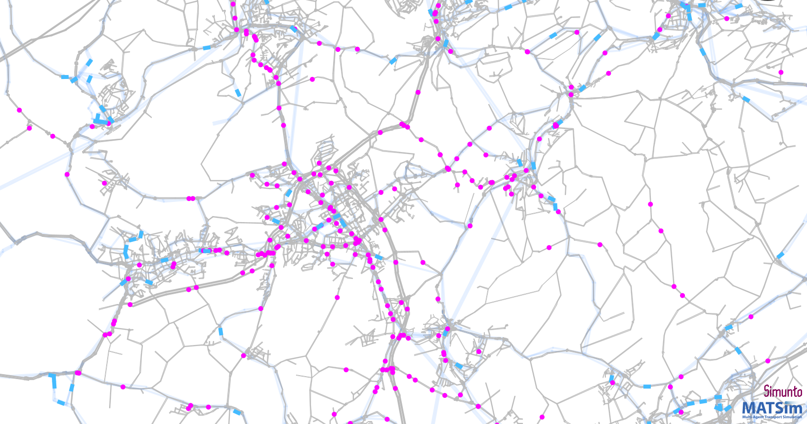

# The MATSim Open Velbert Scenario

 

## About this project

This repository provides an open MATSim transport model for Velbert, Germany, generated by the [Transport Systems Planning and Transport Telematics group](https://www.vsp.tu-berlin.de) of [Technische Universität Berlin](http://www.tu-berlin.de).

<a rel="TU Berlin" href="https://www.vsp.tu-berlin.de"></a><span>&nbsp;&nbsp;&nbsp;&nbsp;&nbsp;&nbsp;</span>
<a rel="TU Berlin" href="https://vsp.berlin/"></a><span>&nbsp;&nbsp;&nbsp;&nbsp;&nbsp;&nbsp;</span>
<a rel="license" href="http://creativecommons.org/licenses/by-nc/4.0/"></a></a><br/>

The model contains a 10pct sample of the Velbert population; road capacities are reduced accordingly. The scenario is calibrated taking into consideration the modal split and mode-specific trip distance distributions.

## Licenses

The **MATSim program code** in this repository is distributed under the terms of the [GNU General Public License as published by the Free Software Foundation (version 2)](https://www.gnu.org/licenses/old-licenses/gpl-2.0.en.html). The MATSim program code are files that reside in the `src` directory hierarchy and typically end with `*.java`.

The **MATSim input files, output files, analysis data and visualizations** are licensed under a <a rel="license" href="http://creativecommons.org/licenses/by-nc/4.0/">Creative Commons Attribution-NonCommercial 4.0 International (CC BY-NC 4.0) License</a>. 
MATSim input files are those that are used as input to run MATSim. They often, but not always, have a header pointing to matsim.org. They typically reside in the `scenarios` directory hierarchy. MATSim output files, analysis data, and visualizations are files generated by MATSim runs, or by postprocessing.  They typically reside in a directory hierarchy starting with `output`.

**Other data files**, in particular in `original-input-data`, have their own individual licenses that need to be individually clarified with the copyright holders.

## Note

Handling of large files within git is not without problems (git lfs files are not included in the zip download; we have to pay; ...). In consequence, large files, both on the input and on the output side, reside at https://svn.vsp.tu-berlin.de/repos/public-svn/matsim/scenarios/countries/de/velbert/velbert-v1.1-10pct .

## Downloading the Project

You can either download the Project as zip File or check it out as a git project

### Download as zip File

1. Download the [Zip-File](https://github.com/matsim-scenarios/matsim-velbert/archive/refs/heads/master.zip)
2. Unzip the Zip-File
3. Follow the instructions in **Building and Running it locally**

### Check out as Git project

1. Check out as Git-Project from Github
2. Follow the instructions in **Building and Running it locally**

## Building and Running it locally

You can build an executable jar-file by executing the following command:

```sh
./mvnw clean package
```

or on Windows:

```sh
.\mvnw.cmd clean package
```

This will download all necessary dependencies (it might take a while the first time it is run) and create a file `matsim-velbert-1.1.jar` in the top directory. This jar file can be executed with Java on the command line:

```sh
java -jar matsim-velbert-1.1.jar run --config ./scenarios/velbert-v1.1-10pct/matsim-velbert-v1.1-10pct.config.xml
```
  
## Import into eclipse

1. download a modern version of eclipse. This should have maven and git included by default.
1. `file->import->git->projects from git->clone URI` and clone as specified above.  _It will go through a 
sequence of windows; it is important that you import as 'general project'._
1. `file->import->maven->existing maven projects`

Sometimes, step 3 does not work, in particular after previously failed attempts.  Sometimes, it is possible to
right-click to `configure->convert to maven project`.  If that fails, the best thing seems to remove all 
pieces of the failed attempt in the directory and start over.

## Import into IntelliJ

`File -> New -> Project from Version Control` paste the repository url and hit 'clone'. IntelliJ usually figures out
that the project is a maven project. If not: `Right click on pom.xml -> import as maven project`.

## Java Version

The project uses Java 11. Usually a suitable SDK is packaged within IntelliJ or Eclipse. Otherwise, one must install a 
suitable sdk manually, which is available [here](https://openjdk.java.net/)